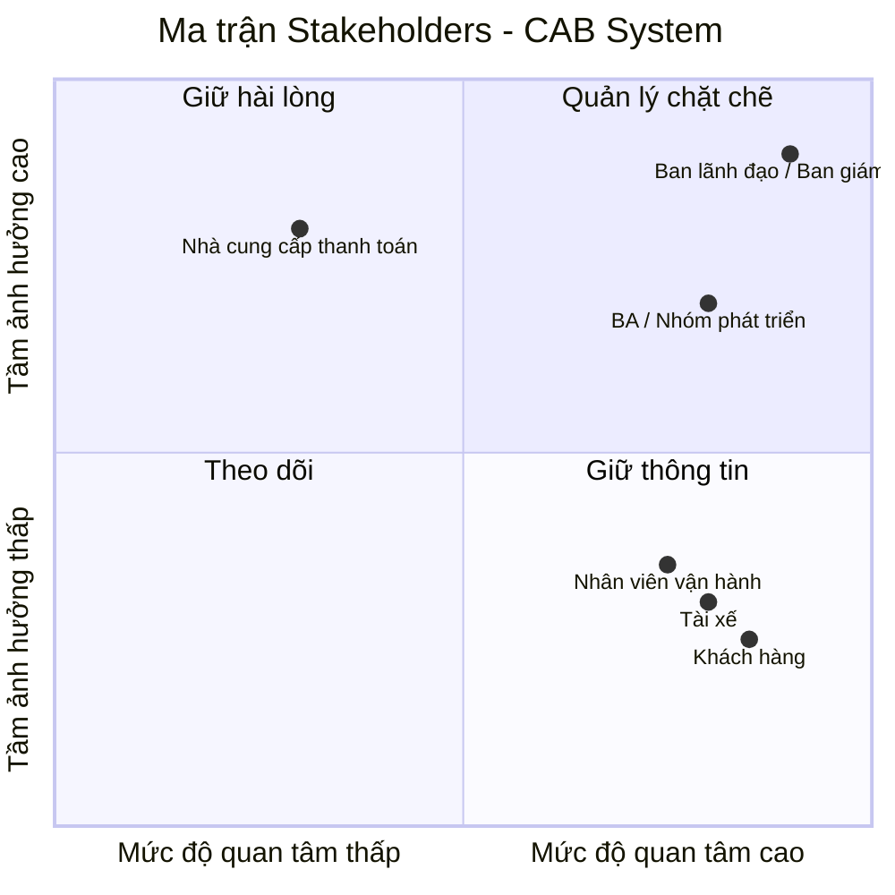
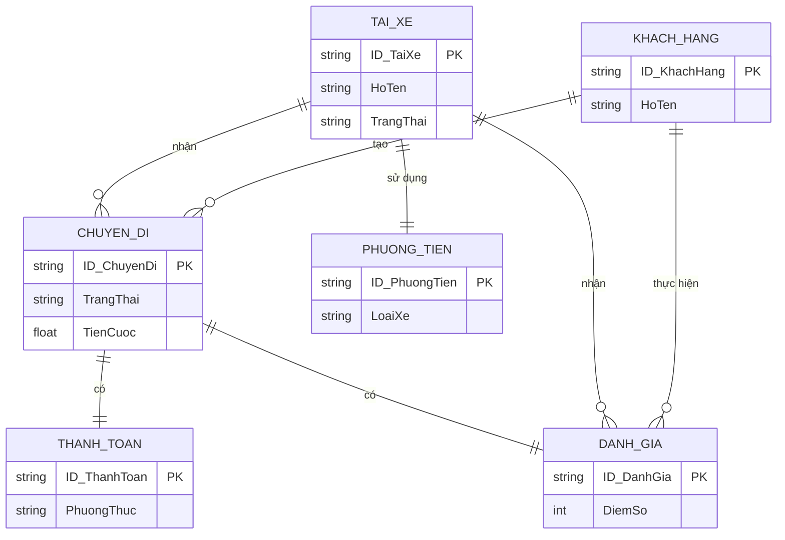
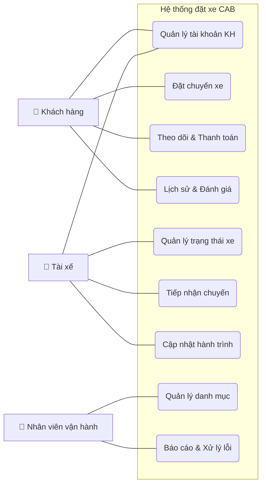

Bước 1: Xây dựng hệ thống cơ bản mvb. Đọc và phân tích yêu cầu của khách hàng ở giai đoạn sơ khởi - hiểu được business contact (ngữ cảnh của nghiệp vụ) và vấn đề của nghiệp vụ. Tại sao làm mới, ai sẽ tham gia.

### 1. Ngữ cảnh của nghiệp vụ
Công ty ABC là một doanh nghiệp đang hoạt động trong lĩnh vực cung cấp dịch vụ đặt xe trực tuyến[cite: 1]. Ở thời điểm hiện tại, khách hàng của công ty liên hệ đặt xe thông qua tổng đài hoặc sử dụng một ứng dụng đơn giản[cite: 1]. 

### 2. Vấn đề nghiệp vụ
Hệ thống và quy trình vận hành hiện tại của ABC đang bộc lộ nhiều hạn chế lớn cản trở sự phát triển:
* Việc phân công và điều phối tài xế chủ yếu được thực hiện bằng phương pháp thủ công[cite: 1].
* Khách hàng gặp khó khăn trong việc theo dõi trạng thái chuyến đi sau khi đặt[cite: 1].
* Thông tin thanh toán không được quản lý một cách tập trung[cite: 1].
* Bộ phận vận hành gặp rào cản lớn khi muốn mở rộng quy mô hệ thống[cite: 1].

### 3. Tại sao làm mới?
Ban lãnh đạo công ty ABC quyết định đầu tư xây dựng một nền tảng CAB System hoàn toàn mới nhằm:
* Có khả năng phục vụ số lượng lớn khách hàng và tài xế cùng lúc với độ ổn định cao[cite: 1].
* Sở hữu kiến trúc hệ thống linh hoạt, cho phép các thành phần (như thanh toán, thông báo) mở rộng độc lập khi tải tăng mà không làm sập toàn bộ hệ thống nếu có lỗi cục bộ[cite: 1].
* Đảm bảo khả năng mở rộng trong tương lai: dễ dàng bổ sung các loại dịch vụ mới, phương thức thanh toán mới, hoặc thay đổi các thành phần kỹ thuật mà không cần phải đập đi xây lại toàn bộ[cite: 1].

### 4. Ai sẽ tham gia?
Hệ thống mới sẽ phục vụ ba nhóm người dùng (Actors) chính yếu[cite: 1]:
* **Khách hàng:** Người có nhu cầu đặt xe, theo dõi chuyến đi, thanh toán và đánh giá dịch vụ[cite: 1].
* **Tài xế:** Người tiếp nhận yêu cầu đặt xe, thực hiện chuyến đi và liên tục cập nhật trạng thái/vị trí[cite: 1].
* **Nhân viên vận hành (Quản trị viên):** Người quản lý tổng thể nền tảng (người dùng, phương tiện, chuyến đi), hỗ trợ xử lý sự cố và theo dõi các báo cáo hiệu quả hoạt động kinh doanh[cite: 1].
1. Ngữ cảnh của nghiệp vụ (Business Context)
Công ty ABC là một doanh nghiệp đang hoạt động trong lĩnh vực cung cấp dịch vụ đặt xe trực tuyến.  Ở thời điểm hiện tại, khách hàng của công ty yêu cầu xe bằng cách liên hệ trực tiếp với tổng đài hoặc thông qua một ứng dụng đơn giản.  Ban giám đốc kỳ vọng xây dựng một nền tảng mới hỗ trợ tối thiểu ba nhóm người dùng chính bao gồm: khách hàng, tài xế và nhân viên vận hành.  Doanh nghiệp mong muốn nền tảng CAB mới này có khả năng phục vụ một số lượng lớn khách hàng và tài xế, đồng thời linh hoạt để phát triển thêm các tính năng trong tương lai.
3. Vấn đề của nghiệp vụ (Business Problems)
Hệ thống và quy trình hiện tại đang bộc lộ nhiều điểm nghẽn cản trở sự phát triển của công ty ABC:Điều phối thiếu tự động hóa: Khâu phân công tài xế chủ yếu vẫn đang được thực hiện một cách thủ công.  Trải nghiệm theo dõi chuyến đi hạn chế: Khách hàng gặp khó khăn trong việc theo dõi trạng thái chuyến đi của mình.  Quản lý dữ liệu phân tán: Thông tin thanh toán trong hệ thống hiện hành chưa được quản lý một cách tập trung.  Rào cản về khả năng mở rộng: Bộ phận vận hành gặp nhiều khó khăn mỗi khi muốn mở rộng quy mô của hệ thống.  Rủi ro gián đoạn toàn hệ thống (Single point of failure): Doanh nghiệp đối mặt với rủi ro lớn khi một lỗi xảy ra ở chức năng thanh toán hoặc thông báo có thể làm cho toàn bộ hệ thống đặt xe ngừng hoạt động.


Bước 2: Xác định các stakeholders, những bên liên quan. Lọc bảng 2 cột. Cột 1 tên stakeholders, Cột 2 là vai trò. Vẽ ma trận stakeholders magic. cho biết tầm ảnh hưởng của stakeholder trong hệ thống bằng công cụ mermaid - dùng để vẽ có sơ đồ lượt đồ trong markdown.


### Bước 2: Xác định các stakeholders, những bên liên quan

| Tên Stakeholder | Vai trò trong hệ thống |
| :--- | :--- |
| **Ban lãnh đạo / Ban giám đốc** | Đưa ra tầm nhìn, quyết định đầu tư và kỳ vọng hệ thống phục vụ được lượng lớn người dùng, có khả năng mở rộng dịch vụ tương lai. Cần xem các báo cáo về doanh thu, số lượng chuyến và hiệu quả hoạt động. |
| **Khách hàng** | Người dùng cuối sử dụng ứng dụng để đăng ký, tìm tài xế, theo dõi chuyến đi, thanh toán và đánh giá tài xế. |
| **Tài xế** | Người trực tiếp cung cấp dịch vụ vận chuyển. Sử dụng hệ thống để nhận/từ chối chuyến, cập nhật trạng thái di chuyển và vị trí. |
| **Nhân viên vận hành** | Người dùng nội bộ có quyền quản trị để quản lý thông tin khách hàng, tài xế, hỗ trợ lỗi và tra cứu lịch sử giao dịch. |
| **Nhà cung cấp thanh toán (Bên thứ 3)** | Đối tác tích hợp bên ngoài để xử lý các giao dịch thanh toán điện tử của khách hàng mà không lưu trực tiếp thông tin nhạy cảm vào hệ thống CAB. |
| **Business Analyst (BA) / Nhóm phát triển** | Phân tích, làm rõ các quy tắc nghiệp vụ chưa chốt và xây dựng giải pháp kiến trúc linh hoạt theo yêu cầu của doanh nghiệp. |

Bước 3: mục đích, mục tiêu nghiệp vụ. liệt kê business gone. viết tắt BG01. ví dụ BG01: Giảm thời gian tìm tài xế, có khả năng tự động tìm tài xế. BG02 hỗ trợ thanh toán cho phéo thanh toán tiền mặt trực tuyến


### Bước 3: Mục đích, mục tiêu nghiệp vụ (Business Goals)

Dự án xây dựng nền tảng CAB System nhằm giải quyết các hạn chế của hệ thống cũ và định hướng phát triển lâu dài, với các mục tiêu nghiệp vụ (Business Goals - BG) cụ thể như sau:

* **BG01:** Tự động hóa quá trình điều phối và phân công tài xế dựa trên vị trí và trạng thái sẵn sàng, giúp giảm thời gian tìm tài xế và ưu tiên tài xế phù hợp ở gần khách hàng[cite: 1].
* **BG02:** Quản lý thông tin thanh toán tập trung, hỗ trợ tính cước tự động và cho phép khách hàng thanh toán linh hoạt bằng tiền mặt hoặc phương thức thanh toán điện tử an toàn (không lưu dữ liệu nhạy cảm)[cite: 1].
* **BG03:** Nâng cao trải nghiệm người dùng thông qua việc cho phép khách hàng theo dõi trạng thái chuyến đi, xem thời gian dự kiến tài xế đến và nhận các thông báo kịp thời về hành trình[cite: 1].
* **BG04:** Xây dựng nền tảng quản trị tập trung, giúp nhân viên vận hành dễ dàng quản lý thông tin (khách hàng, tài xế, chuyến đi), xử lý lỗi và cung cấp các báo cáo hiệu quả hoạt động (doanh thu, tỷ lệ hủy chuyến)[cite: 1].
* **BG05:** Đảm bảo hệ thống hoạt động ổn định, có khả năng chịu tải để phục vụ số lượng lớn người dùng cùng lúc, đặc biệt là vào các thời điểm nhu cầu đặt xe tăng cao[cite: 1].
* **BG06:** Xây dựng kiến trúc hệ thống linh hoạt, cho phép các thành phần (như thanh toán, thông báo) mở rộng độc lập và dễ dàng tích hợp thêm các dịch vụ mới trong tương lai mà không phải xây dựng lại toàn bộ ứng dụng[cite: 1].

Bước 4: xác định phạm vi yêu cầu, không làm lung tung quá tải.
- Ví dụ: Quản lý khách hàng, quản lý tài xế 
- Xác định có module cơ bản dưới góc độ là 1 hệ thống mvp
- Xác định, liệt kê Ngoài phạm vi không nên làm

### Bước 4: Xác định phạm vi yêu cầu (Project Scope)

Để đảm bảo dự án triển khai đúng tiến độ 7 tuần và tập trung vào các tính năng cốt lõi (MVP), phạm vi hệ thống CAB System được xác định như sau:

#### 4.1. Trong phạm vi (In-Scope - Các Module cơ bản của MVP)
Hệ thống sẽ tập trung xây dựng các tính năng phục vụ luồng đặt xe và vận hành cơ bản nhất:
*   **Module Khách hàng:** Đăng ký/đăng nhập, cập nhật thông tin cá nhân, đặt xe (nhập điểm đón/đến, chọn loại xe), theo dõi trạng thái chuyến đi, xem lịch sử chuyến, thanh toán và đánh giá tài xế[cite: 1].
*   **Module Tài xế:** Quản lý hồ sơ và phương tiện, chuyển trạng thái sẵn sàng, nhận/từ chối chuyến xe, và cập nhật trạng thái theo thời gian thực (đã đến, đã đón, đang di chuyển, hoàn thành)[cite: 1].
*   **Module Điều phối (Core):** Thuật toán tự động tìm kiếm, đề xuất và phân công tài xế phù hợp/gần nhất với khách hàng, có cơ chế chuyển tài xế khác nếu bị từ chối[cite: 1].
*   **Module Thanh toán & Tính cước:** Tính số tiền cước dựa trên thông tin chuyến đi; hỗ trợ thanh toán tiền mặt và tích hợp với một nhà cung cấp thanh toán điện tử bên thứ ba[cite: 1].
*   **Module Thông báo:** Gửi thông báo tự động cho khách hàng và tài xế về các sự kiện quan trọng (nhận chuyến, đến điểm đón, hoàn thành, thanh toán)[cite: 1].
*   **Module Quản trị (Admin):** Phân quyền truy cập cơ bản; quản lý khách hàng, tài xế, phương tiện, chuyến đi; tra cứu lịch sử giao dịch và cung cấp báo cáo thống kê cơ bản (số chuyến, doanh thu, tỷ lệ hoàn thành/hủy)[cite: 1].

#### 4.2. Ngoài phạm vi (Out-of-Scope - Không làm trong giai đoạn MVP)
Để tránh quá tải và rủi ro, hệ thống sẽ KHÔNG bao gồm các chức năng sau trong giai đoạn này:
*   **Lưu trữ dữ liệu nhạy cảm:** Không lưu trữ trực tiếp thông tin thẻ hoặc tài khoản thanh toán ngân hàng của khách hàng trên cơ sở dữ liệu của hệ thống CAB[cite: 1].
*   **Tích hợp đa dịch vụ/Đa đối tác:** Chưa phát triển thêm các loại hình dịch vụ mới, hoặc tích hợp thêm nhiều phương thức thanh toán/nhà cung cấp thông báo khác nhau cùng lúc[cite: 1].
*   **Các quy tắc nghiệp vụ phức tạp chưa thống nhất:** Tạm thời sử dụng các thuật toán và luồng xử lý cơ bản nhất đối với việc tính cước, chính sách hủy chuyến, tiêu chí ưu tiên tài xế và kịch bản mất kết nối mạng, cho đến khi có quyết định chính thức từ ban lãnh đạo[cite: 1].

Bước 5:
- gặp khách hàng để xác nhận lại. rồi chuyển yêu cầu này thì Business Requirements ký hiệu là BR01, BR02,..Ví dụ BR01 đặt chuyến xe. Lập bảng mã bao gồm 3 cột stt, tên, diễn giải vd cho phép khách hàng đặt xe, cung cấp nơi đến
### Bước 5: Chuyển đổi yêu cầu thành Business Requirements (BR)

Sau khi gặp khách hàng để xác nhận lại các luồng thông tin cơ bản, dưới đây là danh sách các yêu cầu nghiệp vụ (Business Requirements) cốt lõi của hệ thống CAB System được chuẩn hóa:

| Mã BR | Tên Yêu cầu Nghiệp vụ | Diễn giải chi tiết |
| :--- | :--- | :--- |
| **BR01** | Quản lý tài khoản và hồ sơ | Khách hàng và tài xế có thể đăng ký tài khoản, đăng nhập và cập nhật thông tin cá nhân hoặc phương tiện; nhân viên vận hành cũng có thể tạo tài khoản cho tài xế. |
| **BR02** | Đặt chuyến xe | Cho phép khách hàng nhập điểm đón, điểm đến, lựa chọn loại xe mong muốn và gửi yêu cầu đặt xe lên hệ thống. |
| **BR03** | Điều phối và phân công tài xế | Hệ thống tự động xác định và ưu tiên tài xế phù hợp, gần khách hàng nhất; nếu tài xế từ chối hoặc không phản hồi, hệ thống tiếp tục tìm người khác mà không yêu cầu khách hàng đặt lại. |
| **BR04** | Tiếp nhận và thực hiện chuyến | Cho phép tài xế chuyển trạng thái sẵn sàng, nhận thông báo chuyến, chấp nhận hoặc từ chối, và cập nhật trạng thái di chuyển (đã đến, đã đón, đang đi, hoàn thành). |
| **BR05** | Theo dõi trạng thái chuyến đi | Hệ thống cho phép khách hàng theo dõi việc tìm tài xế, xem thông tin tài xế đã nhận, thời gian dự kiến đến và trạng thái chuyến đi theo thời gian thực. |
| **BR06** | Tính cước và Thanh toán | Hệ thống tự động tính tiền dựa trên loại dịch vụ; hỗ trợ thanh toán tiền mặt hoặc điện tử qua đối tác thứ 3, và có cơ chế xử lý lại nếu giao dịch thanh toán điện tử thất bại. |
| **BR07** | Hệ thống thông báo | Tự động gửi thông báo cho khách hàng và tài xế ở các cột mốc quan trọng (đã tiếp nhận yêu cầu, tài xế nhận chuyến, tài xế đến nơi, hoàn thành chuyến và kết quả thanh toán). |
| **BR08** | Lịch sử và Đánh giá | Cho phép khách hàng xem lại lịch sử các chuyến đi đã thực hiện, chi tiết số tiền đã trả và thực hiện đánh giá tài xế sau khi chuyến đi kết thúc. |
| **BR09** | Quản trị và Báo cáo vận hành | Cung cấp giao diện phân quyền cho nhân viên vận hành để quản lý hệ thống, xử lý chuyến lỗi, tra cứu giao dịch và xem báo cáo (doanh thu, tỷ lệ hủy, hiệu quả tài xế). |

Bước 6: Xây dựng business process. Ví dụ khách: đặt chuyến cần tạo chuyến đi, xác nhận điểm đón điểm đến, xác nhận, tìm tài xế, nếu tìm được, thì đợi tài xế chấp nhận,...
### Bước 6: Xây dựng quy trình nghiệp vụ (Business Process)

Dưới đây là luồng quy trình nghiệp vụ cốt lõi nhất của hệ thống CAB System: **Quy trình Đặt xe và Thực hiện chuyến đi**.

**Luồng chính (Main Flow):**
1. **Khách hàng** đăng nhập, nhập thông tin điểm đón, điểm đến, chọn loại xe và gửi yêu cầu đặt chuyến[cite: 1].
2. **Hệ thống** tiếp nhận yêu cầu, hiển thị trạng thái đang tìm kiếm và tự động xác định các tài xế phù hợp ở gần vị trí khách hàng[cite: 1].
3. **Hệ thống** gửi thông báo yêu cầu nhận chuyến đến ứng dụng của **Tài xế** phù hợp nhất[cite: 1].
4. **Tài xế** nhận thông báo và bấm thao tác "Chấp nhận" chuyến đi[cite: 1].
5. **Hệ thống** lập tức thông báo lại cho **Khách hàng** thông tin tài xế đã nhận chuyến và dự kiến thời gian tài xế đến[cite: 1].
6. **Tài xế** di chuyển và cập nhật trạng thái "Đã đến điểm đón" trên ứng dụng[cite: 1].
7. **Tài xế** gặp khách, cập nhật trạng thái "Đã đón khách" và hệ thống chuyển sang trạng thái "Đang di chuyển"[cite: 1].
8. Khi đến điểm đến, **Tài xế** cập nhật trạng thái "Hoàn thành chuyến"[cite: 1].
9. **Hệ thống** tự động tính toán tổng số tiền cước thực tế phải trả dựa trên thông tin chuyến đi[cite: 1].
10. **Khách hàng** tiến hành thanh toán và **Hệ thống** gửi thông báo khi thanh toán có kết quả thành công[cite: 1].
11. **Khách hàng** có thể xem lại số tiền đã trả và thực hiện đánh giá (rating) tài xế để kết thúc quy trình[cite: 1].

**Các luồng ngoại lệ (Alternate Flows / Exceptions):**
* **Ngoại lệ ở bước 4 (Tài xế từ chối / Bỏ qua):** Nếu tài xế đầu tiên từ chối hoặc hết thời gian chờ phản hồi, hệ thống sẽ tự động chuyển yêu cầu sang cho tài xế phù hợp tiếp theo mà không bắt khách hàng phải tạo lại yêu cầu[cite: 1].
* **Ngoại lệ ở bước 4 (Không tìm được tài xế):** Nếu hệ thống đã tìm kiếm diện rộng mà không có tài xế nào nhận chuyến, hệ thống phải gửi thông báo rõ ràng cho khách hàng để họ nắm thông tin[cite: 1].
* **Ngoại lệ ở bước 10 (Lỗi thanh toán):** Nếu khách hàng chọn thanh toán điện tử nhưng giao dịch bị thất bại, hệ thống sẽ thông báo lỗi cho khách hàng và cho phép họ thao tác xử lý lại theo chính sách[cite: 1].

Bước 7: Thiết kế phân rả yêu cầu nghiệp vụ từ BR (mã viết tắt Funtional Requerement là FR). Ví dụ FR01: Tìm tài xế. FR02: Chọn những  tài xế online. FR03: chọn loại xe. FR04: Chọn tài xế có đánh giá cao. Lưu ý đọc vào yêu cầu có thì mới đưa vô các ví dụ chỉ là gợi ý chưa chắc có trong yêu cầu
### Bước 7: Phân rã yêu cầu nghiệp vụ thành Yêu cầu chức năng (Functional Requirements - FR)

Dưới đây là danh sách phân rã chi tiết các chức năng hệ thống dựa trên yêu cầu từ các bên liên quan.

| Mã FR | Thuộc mã BR | Tên Yêu cầu chức năng (FR) | Diễn giải chi tiết (Dựa trên tài liệu dự án) |
| :--- | :--- | :--- | :--- |
| **FR01** | BR01 | Đăng ký và đăng nhập tài khoản | Hệ thống cho phép khách hàng và tài xế tự đăng ký tài khoản, đăng nhập vào ứng dụng[cite: 1]. Nhân viên vận hành cũng có quyền tạo tài khoản cho tài xế[cite: 1]. |
| **FR02** | BR01 | Cập nhật hồ sơ | Người dùng (khách hàng, tài xế) có thể cập nhật thông tin cá nhân; tài xế có thể cập nhật thêm thông tin phương tiện[cite: 1]. |
| **FR03** | BR02 | Nhập thông tin hành trình | Khách hàng có thể nhập điểm đón và điểm đến trên hệ thống[cite: 1]. |
| **FR04** | BR02 | Chọn loại xe và đặt chuyến | Khách hàng được lựa chọn loại xe mong muốn và nhấn gửi yêu cầu đặt xe[cite: 1]. |
| **FR05** | BR03 | Tìm kiếm và lọc tài xế | Khi có yêu cầu, hệ thống tự động xác định các tài xế phù hợp dựa trên vị trí, trạng thái sẵn sàng và các tiêu chí vận hành khác[cite: 1]. |
| **FR06** | BR03 | Ưu tiên tài xế | Hệ thống ưu tiên đề xuất chuyến đi cho những tài xế phù hợp và đang ở gần khách hàng nhất[cite: 1]. |
| **FR07** | BR03 | Chuyển tiếp yêu cầu tự động | Nếu tài xế đầu tiên không phản hồi hoặc từ chối, hệ thống tự động tiếp tục tìm tài xế khác mà không bắt khách hàng tạo lại chuyến[cite: 1]. |
| **FR08** | BR04 | Quản lý trạng thái hoạt động | Tài xế có thể bật/tắt (chuyển sang trạng thái sẵn sàng nhận chuyến) khi đang làm việc[cite: 1]. |
| **FR09** | BR04 | Tiếp nhận chuyến xe | Tài xế có quyền thao tác chấp nhận hoặc từ chối khi nhận được thông báo yêu cầu chuyến mới phù hợp[cite: 1]. |
| **FR10** | BR04 | Cập nhật hành trình | Trong quá trình chạy, tài xế cập nhật các mốc trạng thái: đã đến điểm đón, đã đón khách, đang di chuyển và hoàn thành chuyến[cite: 1]. |
| **FR11** | BR04 | Theo dõi vị trí tài xế | Hệ thống liên tục lưu thông tin vị trí của tài xế để hỗ trợ tìm kiếm và tính toán thời gian đến[cite: 1]. |
| **FR12** | BR05 | Hiển thị trạng thái chuyến | Khách hàng được xem tiến trình hệ thống tìm tài xế, biết tài xế nào đã nhận, thời gian dự kiến đến và trạng thái di chuyển hiện tại[cite: 1]. |
| **FR13** | BR06 | Tính tiền cước | Sau khi chuyến kết thúc, hệ thống xác định số tiền khách phải trả dựa trên loại dịch vụ và thông tin chuyến[cite: 1]. |
| **FR14** | BR06 | Thanh toán | Cho phép khách hàng chọn thanh toán bằng tiền mặt hoặc qua phương thức điện tử tích hợp với bên thứ 3 (không lưu thông tin nhạy cảm vào CAB)[cite: 1]. |
| **FR15** | BR06 | Xử lý thanh toán lỗi | Cho phép khách hàng thực hiện xử lý thanh toán lại nếu giao dịch điện tử thất bại[cite: 1]. |
| **FR16** | BR07 | Nhận thông báo (Khách hàng) | Hệ thống báo cho khách khi: tiếp nhận yêu cầu, có tài xế nhận, tài xế đến nơi, hoàn thành chuyến, kết quả thanh toán[cite: 1]. |
| **FR17** | BR07 | Nhận thông báo (Tài xế) | Hệ thống báo cho tài xế khi: có chuyến mới, hoặc có thay đổi liên quan đến chuyến đang thực hiện[cite: 1]. |
| **FR18** | BR08 | Xem lịch sử và Đánh giá | Khách hàng có thể xem lại lịch sử các chuyến, số tiền đã trả và thực hiện đánh giá tài xế[cite: 1]. |
| **FR19** | BR09 | Quản lý thực thể hệ thống | Cung cấp giao diện cho nhân viên xem và quản lý danh sách khách hàng, tài xế, phương tiện và chuyến đi[cite: 1]. |
| **FR20** | BR09 | Phân quyền và Giám sát | Phân quyền truy cập các chức năng quản trị nhạy cảm; lưu vết (log) các thao tác quan trọng để phục vụ kiểm tra sự cố[cite: 1]. |
| **FR21** | BR09 | Báo cáo thống kê | Nhân viên vận hành xem được báo cáo số lượng chuyến, doanh thu, tỷ lệ hoàn thành/hủy chuyến, và hiệu quả của tài xế[cite: 1]. |

Bước 8: Business rule và acception, xảy ra ngoại lệ thì sao, những tài xế nào trong trại thái sẵn sàng mới tạo chuyến, nếu đợi tài xế lâu quá, quá thời hạn tài xế không chấp nhận
### Bước 8: Thiết kế Quy tắc nghiệp vụ (Business Rules) và Xử lý ngoại lệ (Exceptions)

Trong quá trình vận hành, hệ thống CAB System phải tuân thủ các quy tắc nghiệp vụ cốt lõi và có cơ chế tự động xử lý khi luồng đi chệch khỏi quỹ đạo bình thường.

#### 8.1. Các quy tắc nghiệp vụ (Business Rules - BRU)

| Mã BRU | Tên Quy tắc | Mô tả chi tiết |
| :--- | :--- | :--- |
| **BRU01** | Điều kiện nhận chuyến | Hệ thống chỉ đề xuất và phân công chuyến đi cho những tài xế đã chuyển sang trạng thái "sẵn sàng nhận chuyến"[cite: 1]. |
| **BRU02** | Tiêu chí ưu tiên phân công | Thuật toán điều phối phải ưu tiên những tài xế phù hợp và có vị trí gần khách hàng nhất[cite: 1]. Các tiêu chí vận hành khác sẽ được bổ sung sau khi chốt với doanh nghiệp[cite: 1]. |
| **BRU03** | Ràng buộc bảo mật thanh toán | Hệ thống tuyệt đối không được lưu trữ trực tiếp các thông tin nhạy cảm của thẻ hoặc tài khoản thanh toán của khách hàng trên cơ sở dữ liệu nội bộ[cite: 1]. |
| **BRU04** | Ràng buộc xác thực & Phân quyền | Khách hàng và tài xế bắt buộc phải được xác thực trước khi sử dụng các tính năng của tài khoản[cite: 1]. Nhân viên vận hành không được thực hiện các thao tác nhạy cảm nếu không được phân quyền phù hợp[cite: 1]. |
| **BRU05** | Lưu vết dữ liệu | Mọi thao tác quan trọng trên hệ thống (dữ liệu giao dịch, thay đổi trạng thái) phải được lưu vết để phục vụ kiểm tra khi có sự cố[cite: 1]. |

#### 8.2. Các trường hợp ngoại lệ (Exceptions - EXC)

| Mã EXC | Tình huống ngoại lệ | Luồng xử lý của hệ thống |
| :--- | :--- | :--- |
| **EXC01** | Tài xế từ chối hoặc hết hạn chờ (Timeout) | Nếu tài xế được đề xuất bấm từ chối hoặc không phản hồi trong thời gian quy định, hệ thống tự động tiếp tục tìm tài xế khác. **Tuyệt đối không** yêu cầu khách hàng tạo lại chuyến xe[cite: 1]. |
| **EXC02** | Không tìm được tài xế | Sau khi hệ thống đã tìm kiếm mà không có tài xế nào nhận chuyến, hệ thống phải dừng tìm kiếm và gửi thông báo rõ ràng cho khách hàng[cite: 1]. |
| **EXC03** | Giao dịch thanh toán thất bại | Nếu thanh toán điện tử bị lỗi, hệ thống phải thông báo ngay cho khách hàng và cung cấp tùy chọn cho phép xử lý thanh toán lại theo chính sách của doanh nghiệp[cite: 1]. |
| **EXC04** | Sự cố mất kết nối mạng | *(Yêu cầu đang chờ làm rõ)* BA cần làm việc thêm với các bên liên quan để chốt chính sách xử lý khi khách hàng hoặc tài xế bị mất mạng giữa chuyến đi[cite: 1]. |
| **EXC05** | Lỗi một phần hệ thống (Thanh toán/Thông báo) | Kiến trúc hệ thống phải đảm bảo các module độc lập. Nếu chức năng thanh toán hoặc thông báo bị lỗi cục bộ, toàn bộ ứng dụng đặt xe vẫn phải hoạt động được, không bị sập toàn hệ thống[cite: 1]. |

Bước 9: Data modeling, xây dựng các model. nhìn vô để xác định các thực thể và vẽ được sơ đồ erd
### Bước 9: Mô hình hóa dữ liệu (Data Modeling - ERD)

Dựa trên các yêu cầu nghiệp vụ, hệ thống CAB System sẽ bao gồm các thực thể cốt lõi sau:

#### 9.1. Xác định các Thực thể (Entities) và Thuộc tính (Attributes)

| Tên Thực thể | Diễn giải dựa trên yêu cầu | Thuộc tính cơ bản (Dự kiến) |
| :--- | :--- | :--- |
| **Khách hàng** | Người đăng ký tài khoản, cập nhật thông tin cá nhân và tạo yêu cầu chuyến đi[cite: 1]. | ID_KhachHang, HoTen, SoDienThoai, MatKhau |
| **Tài xế** | Người đăng ký hồ sơ, quản lý trạng thái sẵn sàng và lưu vị trí hiện tại[cite: 1]. | ID_TaiXe, HoTen, SoDienThoai, TrangThai (Sẵn sàng/Đang bận), ViTriHienTai |
| **Phương tiện** | Thông tin xe do tài xế hoặc nhân viên vận hành cập nhật, dùng để khớp với "loại xe" khách hàng chọn[cite: 1]. | ID_PhuongTien, ID_TaiXe, BienSo, LoaiXe |
| **Chuyến đi** | Thực thể trung tâm lưu thông tin hành trình từ khi đặt đến khi hoàn thành[cite: 1]. | ID_ChuyenDi, ID_KhachHang, ID_TaiXe, DiemDon, DiemDen, TrangThai, TienCuoc |
| **Thanh toán** | Lưu trữ thông tin giao dịch. Lưu ý: Chỉ lưu trạng thái và số tiền, không lưu thẻ tín dụng/nhạy cảm[cite: 1]. | ID_ThanhToan, ID_ChuyenDi, PhuongThuc (Tiền mặt/Điện tử), TrangThaiGiaoDich |
| **Đánh giá** | Khách hàng thực hiện đánh giá tài xế sau khi chuyến đi hoàn thành[cite: 1]. | ID_DanhGia, ID_ChuyenDi, ID_KhachHang, ID_TaiXe, DiemSo, NhanXet |
| **Nhân viên vận hành**| Người dùng có quyền quản trị để quản lý hệ thống và tra cứu lịch sử[cite: 1]. | ID_NhanVien, HoTen, PhanQuyen |

#### 9.2. Sơ đồ Thực thể Liên kết (ERD)

Dưới đây là sơ đồ mô tả mối quan hệ giữa các thực thể trong hệ thống:


Bước 10: Tự thiết kế, Xác định các non-functional requirement - chức năng không phải yêu cầu
### Bước 10: Yêu cầu phi chức năng (Non-Functional Requirements - NFR)

Bên cạnh các tính năng sử dụng trực tiếp, hệ thống CAB System phải đáp ứng các tiêu chuẩn nghiêm ngặt về chất lượng phần mềm, kiến trúc và bảo mật như sau:

| Mã NFR | Phân loại | Tên Yêu cầu | Mô tả chi tiết |
| :--- | :--- | :--- | :--- |
| **NFR01** | Hiệu năng (Performance) | Khả năng chịu tải cao | Hệ thống phải hoạt động ổn định vào các thời điểm nhu cầu tăng cao, đảm bảo phục vụ được số lượng lớn khách hàng và tài xế cùng lúc mà không bị gián đoạn[cite: 1]. |
| **NFR02** | Khả năng mở rộng (Scalability) | Mở rộng độc lập | Các thành phần của hệ thống cần có khả năng mở rộng độc lập khi tải tăng; kiến trúc phải đủ linh hoạt để bổ sung dịch vụ hoặc đối tác mới trong tương lai mà không phải xây dựng lại toàn bộ[cite: 1]. |
| **NFR03** | Tính khả dụng (Availability) | Tránh rủi ro sập toàn hệ thống | Một lỗi cục bộ xảy ra ở chức năng thanh toán hoặc thông báo tuyệt đối không được làm cho toàn bộ hệ thống đặt xe ngừng hoạt động[cite: 1]. Các module phải được cách ly lỗi tốt. |
| **NFR04** | Tính bảo trì (Maintainability) | Triển khai không gián đoạn | Các chức năng mới hoặc các bản cập nhật phải có thể được triển khai từng phần, hạn chế tối đa việc ảnh hưởng đến các chức năng đang hoạt động của người dùng[cite: 1]. |
| **NFR05** | Bảo mật (Security) | Xác thực và Phân quyền | Khách hàng và tài xế bắt buộc phải được xác thực (Authentication) trước khi sử dụng. Các thao tác quản trị của nhân viên phải được kiểm soát quyền truy cập chặt chẽ (Authorization)[cite: 1]. |
| **NFR06** | An toàn dữ liệu (Data Privacy) | Bảo vệ dữ liệu nhạy cảm | Thông tin cá nhân, phương tiện, vị trí và giao dịch phải được bảo vệ. Đặc biệt, hệ thống CAB không được lưu trữ trực tiếp thông tin nhạy cảm của thẻ hoặc tài khoản thanh toán[cite: 1]. |
| **NFR07** | Khả năng truy vết (Auditability) | Lưu vết hệ thống (Logging) | Doanh nghiệp yêu cầu hệ thống phải lưu vết (log) toàn bộ các thao tác quan trọng để phục vụ quá trình kiểm tra, đối soát khi có sự cố xảy ra[cite: 1]. |

```
Bước 11: Vẽ các usecase, ký hiệu UC01 tên là customer trong đó sẽ có gì, thiết kế cái usecase diagram,
### Bước 11: Xác định Use Case và Sơ đồ Use Case Diagram

#### 11.1. Danh sách Use Case

| Mã Nhóm | Tác nhân | Các Use Case chi tiết |
| :--- | :--- | :--- |
| **UC01** | **Customer (Khách hàng)** | Đăng ký, cập nhật thông tin cá nhân, đặt chuyến xe, theo dõi hành trình, thanh toán và đánh giá tài xế[cite: 1]. |
| **UC02** | **Driver (Tài xế)** | Cập nhật hồ sơ phương tiện, quản lý trạng thái sẵn sàng, tiếp nhận chuyến và cập nhật trạng thái di chuyển[cite: 1]. |
| **UC03** | **Admin (Nhân viên vận hành)** | Quản lý thông tin người dùng, hỗ trợ xử lý lỗi giao dịch và xem báo cáo hoạt động[cite: 1]. |

#### 11.2. Sơ đồ Use Case Diagram (Mô hình hóa bằng Mermaid)


Bước 12: sau đó đặc tả usecase 
Bước 13: Những tiêu chí chấp nhận, case ký hiệu là AC. Để tập hợp điều kiện quy tắc cụ thể mà 1 tính năng cần đáp ứng để giúp người làm phần mềm xác định khi nào người làm phần mềm cần kết thúc và nghiệm thu,
bước 15: Truy xuất nguồn gốc yêu cầu, quá trình theo dõi yêu cầu tới bước  kiểm thử, tạo bảng ma trận truy xuất yêu cầu tên là RTM, sẽ có các cột: BC, BR, FR, UC, AC. cho biết BC nào tương ứng BR nào, BR nào phân rã FR nào, FR tương ứng AC nào khi kết thúc, điền cho đủ 5 cột
Testcase đi từ phân tích thiết kế hệ thống
