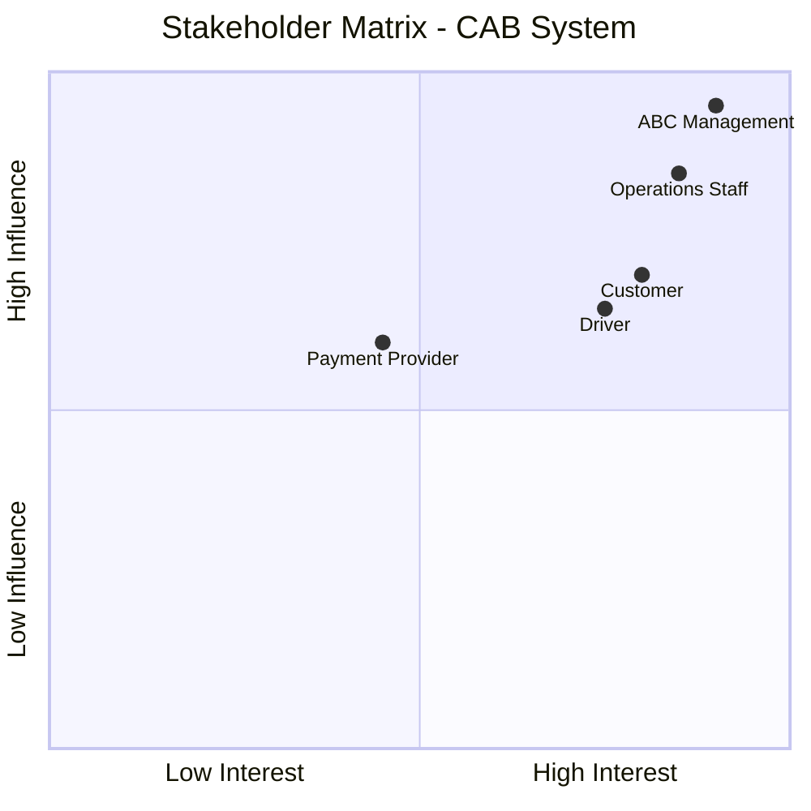
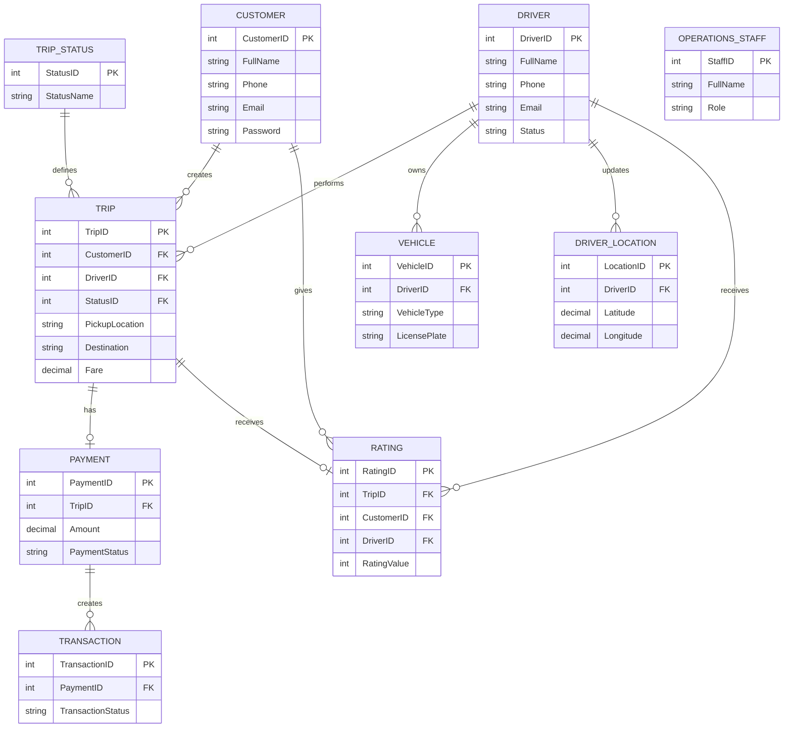
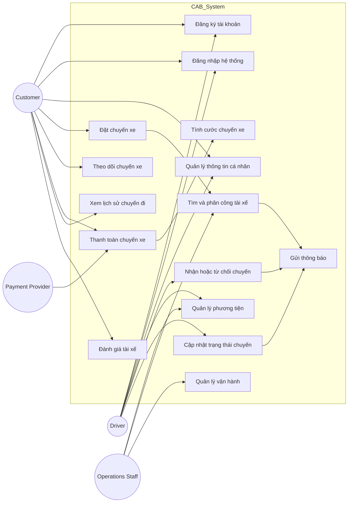

# Bước 1: Đọc và phân tích sơ khởi yêu cầu khách hàng (Business Context)

## 1. Bối cảnh nghiệp vụ (Business Context)

Công ty ABC là doanh nghiệp cung cấp dịch vụ đặt xe trực tuyến. Hiện tại, khách hàng có thể yêu cầu xe thông qua tổng đài hoặc một ứng dụng đơn giản.

Tuy nhiên, quy trình vận hành hiện tại còn tồn tại nhiều hạn chế như việc tìm kiếm và phân công tài xế chủ yếu thực hiện thủ công, khách hàng gặp khó khăn trong việc theo dõi trạng thái chuyến đi, thông tin thanh toán chưa được quản lý tập trung và bộ phận vận hành gặp khó khăn khi số lượng khách hàng, tài xế ngày càng tăng.

Công ty ABC mong muốn xây dựng hệ thống **CAB System** - nền tảng đặt xe nhằm hỗ trợ toàn bộ quy trình nghiệp vụ từ khi khách hàng tạo yêu cầu đặt xe, hệ thống tìm kiếm tài xế, tài xế thực hiện chuyến đi, tính cước, thanh toán, gửi thông báo và đánh giá sau chuyến.

Hệ thống được xây dựng theo hướng **MVB/MVP (Minimum Viable Business/Product)**, tập trung vào các nghiệp vụ quan trọng nhất để giải quyết vấn đề hiện tại của doanh nghiệp, đồng thời có khả năng mở rộng trong tương lai.

---

## 2. Vấn đề nghiệp vụ hiện tại (Business Problems)

Sau khi phân tích quy trình hoạt động hiện tại của công ty ABC, các vấn đề chính được xác định:

| Mã | Vấn đề nghiệp vụ | Diễn giải |
|---|---|---|
| BP01 | Điều phối tài xế thủ công | Việc tìm kiếm và phân công tài xế chủ yếu dựa vào nhân viên vận hành, gây mất thời gian và khó đảm bảo lựa chọn tối ưu. |
| BP02 | Khó theo dõi trạng thái chuyến đi | Khách hàng không thể dễ dàng biết trạng thái xử lý yêu cầu, thông tin tài xế và tiến trình chuyến đi. |
| BP03 | Quản lý thanh toán chưa tập trung | Thông tin về chi phí chuyến đi và kết quả thanh toán chưa được quản lý trên một hệ thống thống nhất. |
| BP04 | Khó mở rộng khi số lượng người dùng tăng | Hệ thống hiện tại khó đáp ứng khi số lượng khách hàng, tài xế và chuyến xe tăng lên. |
| BP05 | Khó kiểm soát hoạt động vận hành | Nhân viên vận hành gặp khó khăn trong việc theo dõi chuyến đi, trạng thái tài xế và xử lý sự cố. |

---

## 3. Tại sao cần xây dựng hệ thống mới? (Why Build New System)

Công ty ABC cần xây dựng hệ thống CAB System mới nhằm giải quyết các vấn đề nghiệp vụ hiện tại:

| Mã | Mục tiêu xây dựng hệ thống |
|---|---|
| WHY01 | Tự động hóa quá trình tìm kiếm và phân công tài xế thay vì xử lý thủ công. |
| WHY02 | Cải thiện trải nghiệm khách hàng thông qua việc đặt xe trực tuyến và theo dõi trạng thái chuyến đi. |
| WHY03 | Quản lý tập trung dữ liệu khách hàng, tài xế, phương tiện, chuyến đi và thanh toán. |
| WHY04 | Hỗ trợ nhân viên vận hành quản lý và giám sát hoạt động hiệu quả hơn. |
| WHY05 | Xây dựng nền tảng có khả năng mở rộng khi doanh nghiệp phát triển. |

---

## 4. Các tác nhân trong hệ thống

Hệ thống CAB System có các nhóm người dùng chính:

| Tác nhân | Vai trò |
|---|---|
| **Customer** | Sử dụng hệ thống để đăng ký tài khoản, đặt xe, theo dõi chuyến đi, thanh toán và đánh giá tài xế. |
| **Driver** | Quản lý thông tin cá nhân, phương tiện, trạng thái hoạt động; nhận và thực hiện chuyến xe. |
| **Operations Staff** | Quản lý khách hàng, tài xế, phương tiện, chuyến xe; theo dõi và hỗ trợ xử lý các trường hợp lỗi. |
| **Payment Provider** | Cung cấp dịch vụ thanh toán điện tử bên ngoài và xử lý giao dịch thanh toán. |
| **ABC Management** | Định hướng mục tiêu kinh doanh, theo dõi hiệu quả hoạt động của hệ thống. |

---

# Bước 2: Xác định Stakeholders

## 2.1. Danh sách Stakeholders

| Stakeholder | Vai trò |
|---|---|
| **Customer** | Đặt chuyến xe, theo dõi trạng thái chuyến đi, thanh toán và đánh giá dịch vụ. |
| **Driver** | Nhận chuyến, cập nhật trạng thái thực hiện chuyến và cung cấp dịch vụ vận chuyển. |
| **Operations Staff** | Quản lý khách hàng, tài xế, phương tiện, chuyến đi và hỗ trợ xử lý sự cố. |
| **ABC Management** | Xác định mục tiêu kinh doanh, phê duyệt yêu cầu và theo dõi hiệu quả hệ thống. |
| **Payment Provider** | Hỗ trợ xử lý các giao dịch thanh toán điện tử. |

---

## 2.2. Stakeholder Matrix

### Phân loại Stakeholder

| Nhóm | Stakeholder |
|---|---|
| Ảnh hưởng cao - Quan tâm cao | ABC Management, Operations Staff |
| Ảnh hưởng trung bình/cao - Quan tâm cao | Customer, Driver |
| Ảnh hưởng trung bình | Payment Provider |

---

# Bước 3: Xác định Business Goal (BG)

Dựa trên vấn đề nghiệp vụ và mong muốn của khách hàng, hệ thống CAB System có các Business Goal:

| Mã | Business Goal | Mục đích của hệ thống |
|---|---|---|
| **BG01** | Tự động hóa tìm và phân công tài xế | Hệ thống có khả năng tự động tìm tài xế phù hợp dựa trên trạng thái sẵn sàng và vị trí. |
| **BG02** | Nâng cao khả năng theo dõi chuyến đi | Cho phép khách hàng theo dõi trạng thái chuyến xe, thông tin tài xế và thời gian dự kiến đến. |
| **BG03** | Hỗ trợ tính cước và thanh toán | Cho phép hệ thống xác định số tiền cần thanh toán và hỗ trợ thanh toán tiền mặt hoặc trực tuyến. |
| **BG04** | Cung cấp thông báo kịp thời | Gửi thông báo cho khách hàng và tài xế khi xảy ra các sự kiện quan trọng. |
| **BG05** | Nâng cao hiệu quả quản lý vận hành | Hỗ trợ nhân viên vận hành quản lý khách hàng, tài xế, chuyến xe và xử lý sự cố. |
| **BG06** | Đảm bảo khả năng mở rộng hệ thống | Cho phép hệ thống phát triển thêm chức năng trong tương lai. |

---

# Bước 4: Xác định phạm vi yêu cầu (Scope)

## 4.1. Phạm vi hệ thống MVB/MVP

Đối với phiên bản MVB/MVP, CAB System tập trung vào các nghiệp vụ cốt lõi:

| STT | Scope | Yêu cầu cần thực hiện |
|---|---|---|
| 1 | Quản lý khách hàng | Đăng ký tài khoản, đăng nhập, cập nhật thông tin cá nhân. |
| 2 | Quản lý tài xế | Quản lý hồ sơ tài xế, trạng thái hoạt động và thông tin phương tiện. |
| 3 | Quản lý phương tiện | Lưu trữ thông tin phương tiện phục vụ chuyến xe. |
| 4 | Đặt chuyến xe | Khách hàng nhập điểm đón, điểm đến, chọn loại xe và gửi yêu cầu. |
| 5 | Tìm và phân công tài xế | Hệ thống tìm tài xế phù hợp và gửi yêu cầu nhận chuyến. |
| 6 | Quản lý chuyến xe | Theo dõi và cập nhật trạng thái chuyến đi. |
| 7 | Tính cước | Xác định số tiền khách hàng phải thanh toán. |
| 8 | Thanh toán | Hỗ trợ thanh toán tiền mặt và thanh toán điện tử. |
| 9 | Thông báo | Gửi thông báo về trạng thái chuyến xe và thanh toán. |
| 10 | Lịch sử và đánh giá | Cho phép khách hàng xem lịch sử và đánh giá tài xế. |
| 11 | Quản lý vận hành | Hỗ trợ nhân viên quản lý và giám sát hoạt động hệ thống. |

---

## 4.2. Ngoài phạm vi MVB/MVP

Các chức năng sau chưa thực hiện trong phiên bản đầu:

| Nội dung | Lý do |
|---|---|
| AI dự đoán nhu cầu đặt xe | Chưa cần thiết trong giai đoạn xây dựng hệ thống cơ bản. |
| Thuật toán tối ưu điều phối phức tạp | MVB chỉ yêu cầu tìm tài xế phù hợp ở mức cơ bản. |
| Chương trình khuyến mãi, tích điểm | Không thuộc quy trình đặt xe cốt lõi. |
| Ví điện tử riêng | Chưa cần thiết vì đã hỗ trợ thanh toán qua bên ngoài. |
| Mở rộng sang giao hàng hoặc dịch vụ khác | Không thuộc phạm vi CAB System hiện tại. |
---
# Bước 5: Xây dựng Business Requirement (BR)

Sau khi phân tích yêu cầu ban đầu và xác nhận lại với khách hàng, các yêu cầu nghiệp vụ của hệ thống CAB System được xác định như sau:

| BR | Tên BR | Diễn giải |
|---|---|---|
| **BR01** | **Quản lý tài khoản khách hàng** | Cho phép khách hàng đăng ký tài khoản, đăng nhập và cập nhật thông tin cá nhân để sử dụng dịch vụ đặt xe. |
| **BR02** | **Quản lý tài xế và phương tiện** | Cho phép quản lý thông tin tài xế, thông tin phương tiện và trạng thái hoạt động của tài xế. |
| **BR03** | **Đặt chuyến xe** | Cho phép khách hàng nhập điểm đón, điểm đến, lựa chọn loại xe và gửi yêu cầu đặt chuyến. |
| **BR04** | **Tìm và phân công tài xế** | Cho phép hệ thống tìm kiếm tài xế phù hợp dựa trên trạng thái sẵn sàng, vị trí và tiêu chí vận hành. |
| **BR05** | **Tiếp nhận và thực hiện chuyến xe** | Cho phép tài xế nhận hoặc từ chối chuyến, cập nhật trạng thái trong quá trình thực hiện chuyến đi. |
| **BR06** | **Theo dõi chuyến xe** | Cho phép khách hàng theo dõi trạng thái chuyến xe, thông tin tài xế và thời gian dự kiến đến. |
| **BR07** | **Tính cước chuyến xe** | Cho phép hệ thống xác định số tiền khách hàng phải trả dựa trên thông tin chuyến đi. |
| **BR08** | **Thanh toán chuyến xe** | Cho phép khách hàng thanh toán bằng tiền mặt hoặc phương thức thanh toán điện tử thông qua nhà cung cấp bên ngoài. |
| **BR09** | **Thông báo** | Cho phép hệ thống gửi thông báo đến khách hàng và tài xế khi có các sự kiện liên quan đến chuyến xe. |
| **BR10** | **Lịch sử và đánh giá chuyến xe** | Cho phép khách hàng xem lịch sử chuyến đi và đánh giá tài xế sau khi chuyến xe hoàn thành. |
| **BR11** | **Quản lý vận hành** | Cho phép nhân viên vận hành quản lý khách hàng, tài xế, phương tiện, chuyến xe và hỗ trợ xử lý sự cố. |

---

# Bước 6: Xây dựng Business Process

## BP01. Quản lý tài khoản khách hàng

Khách hàng → Đăng ký tài khoản → Nhập thông tin cá nhân → Hệ thống kiểm tra thông tin → Tạo tài khoản → Đăng nhập hệ thống → Cập nhật thông tin khi cần thiết.

---

## BP02. Quản lý tài xế và phương tiện

Tài xế/Nhân viên vận hành → Tạo tài khoản tài xế → Cập nhật hồ sơ tài xế → Cập nhật thông tin phương tiện → Cập nhật trạng thái hoạt động.

Tài xế có thể chuyển sang trạng thái sẵn sàng để nhận chuyến xe.

---

## BP03. Đặt chuyến xe và tìm tài xế

Khách hàng → Nhập điểm đón → Nhập điểm đến → Chọn loại xe → Gửi yêu cầu đặt xe → Hệ thống tiếp nhận yêu cầu → Tạo chuyến xe → Tìm tài xế phù hợp → Gửi yêu cầu nhận chuyến đến tài xế.

Nếu tài xế chấp nhận:

Hệ thống xác nhận tài xế → Thông báo thông tin tài xế cho khách hàng.

Nếu tài xế từ chối hoặc không phản hồi:

Hệ thống tiếp tục tìm tài xế khác.

Nếu không tìm được tài xế:

Hệ thống thông báo cho khách hàng.

---

## BP04. Thực hiện và theo dõi chuyến xe

Tài xế nhận chuyến → Di chuyển đến điểm đón → Cập nhật "Đã đến điểm đón" → Đón khách → Cập nhật "Đã đón khách" → Di chuyển đến điểm đến → Cập nhật "Hoàn thành chuyến".

Trong quá trình thực hiện:

Khách hàng → Theo dõi trạng thái chuyến xe → Xem thông tin tài xế → Theo dõi thời gian dự kiến đến.

---

## BP05. Tính cước và thanh toán

Chuyến xe hoàn thành → Hệ thống xác định số tiền phải trả → Khách hàng chọn phương thức thanh toán.

Nếu thanh toán tiền mặt:

Khách hàng thanh toán trực tiếp → Hệ thống ghi nhận kết quả.

Nếu thanh toán điện tử:

Hệ thống gửi yêu cầu thanh toán đến Payment Provider → Nhận kết quả giao dịch → Cập nhật trạng thái thanh toán.

Nếu thanh toán thất bại:

Hệ thống thông báo lỗi → Cho phép khách hàng xử lý lại.

---

## BP06. Thông báo

Phát sinh sự kiện → Hệ thống xác định đối tượng nhận thông báo → Gửi thông báo.

Các sự kiện gồm:

- Yêu cầu đặt xe được tiếp nhận.
- Có tài xế nhận chuyến.
- Tài xế đến điểm đón.
- Chuyến xe hoàn thành.
- Thanh toán có kết quả.

---

## BP07. Lịch sử và đánh giá chuyến xe

Chuyến xe hoàn thành → Lưu thông tin chuyến đi → Khách hàng xem lịch sử chuyến xe → Khách hàng đánh giá tài xế.

---

## BP08. Quản lý vận hành

Nhân viên vận hành → Quản lý khách hàng → Quản lý tài xế → Quản lý phương tiện → Theo dõi chuyến xe → Kiểm tra trạng thái tài xế → Hỗ trợ xử lý lỗi → Tra cứu lịch sử giao dịch.

---

# Bước 7: Phân rã Business Requirement thành Functional Requirement (FR)

| BR | Functional Requirement | Tên FR | Diễn giải |
|---|---|---|---|
| BR01 | FR01 | Đăng ký tài khoản khách hàng | Cho phép khách hàng tạo tài khoản mới để sử dụng dịch vụ. |
| BR01 | FR02 | Đăng nhập khách hàng | Cho phép khách hàng đăng nhập vào hệ thống. |
| BR01 | FR03 | Cập nhật thông tin cá nhân | Cho phép khách hàng thay đổi thông tin cá nhân. |
| BR02 | FR04 | Quản lý hồ sơ tài xế | Cho phép cập nhật thông tin cá nhân của tài xế. |
| BR02 | FR05 | Quản lý phương tiện | Cho phép quản lý thông tin phương tiện của tài xế. |
| BR02 | FR06 | Cập nhật trạng thái tài xế | Cho phép tài xế cập nhật trạng thái sẵn sàng hoặc không sẵn sàng. |
| BR03 | FR07 | Nhập thông tin chuyến xe | Cho phép khách hàng nhập điểm đón, điểm đến và loại xe. |
| BR03 | FR08 | Tạo yêu cầu đặt xe | Cho phép khách hàng gửi yêu cầu đặt chuyến. |
| BR04 | FR09 | Tìm tài xế phù hợp | Hệ thống tìm tài xế dựa trên vị trí và trạng thái hoạt động. |
| BR04 | FR10 | Gửi yêu cầu nhận chuyến | Hệ thống gửi thông tin chuyến xe đến tài xế. |
| BR04 | FR11 | Xử lý tài xế từ chối | Hệ thống tìm tài xế khác khi tài xế từ chối hoặc không phản hồi. |
| BR04 | FR12 | Thông báo không tìm được tài xế | Thông báo cho khách hàng khi không có tài xế phù hợp. |
| BR05 | FR13 | Nhận chuyến xe | Cho phép tài xế chấp nhận chuyến xe. |
| BR05 | FR14 | Từ chối chuyến xe | Cho phép tài xế từ chối chuyến xe. |
| BR05 | FR15 | Cập nhật trạng thái chuyến | Cho phép tài xế cập nhật trạng thái chuyến đi. |
| BR06 | FR16 | Theo dõi chuyến xe | Cho phép khách hàng xem trạng thái chuyến xe. |
| BR06 | FR17 | Xem thông tin tài xế | Hiển thị thông tin tài xế nhận chuyến. |
| BR06 | FR18 | Xem thời gian dự kiến đến | Hiển thị thời gian dự kiến tài xế đến điểm đón. |
| BR07 | FR19 | Tính cước chuyến xe | Xác định số tiền khách hàng cần thanh toán. |
| BR08 | FR20 | Thanh toán tiền mặt | Ghi nhận thanh toán bằng tiền mặt. |
| BR08 | FR21 | Thanh toán điện tử | Xử lý thanh toán thông qua Payment Provider. |
| BR08 | FR22 | Xử lý thanh toán thất bại | Thông báo lỗi và hỗ trợ thanh toán lại. |
| BR09 | FR23 | Gửi thông báo | Gửi thông báo đến khách hàng và tài xế. |
| BR10 | FR24 | Xem lịch sử chuyến xe | Cho phép khách hàng xem các chuyến đã thực hiện. |
| BR10 | FR25 | Đánh giá tài xế | Cho phép khách hàng đánh giá tài xế. |
| BR11 | FR26 | Quản lý khách hàng | Cho phép nhân viên quản lý thông tin khách hàng. |
| BR11 | FR27 | Quản lý tài xế | Cho phép nhân viên quản lý thông tin tài xế. |
| BR11 | FR28 | Quản lý phương tiện | Cho phép nhân viên quản lý thông tin phương tiện. |
| BR11 | FR29 | Quản lý chuyến xe | Cho phép nhân viên theo dõi và quản lý chuyến xe. |
| BR11 | FR30 | Tra cứu lịch sử giao dịch | Cho phép nhân viên tra cứu giao dịch. |

---

# Bước 8: Business Rule và Acceptance Criteria

## 8.1. Business Rule

| Mã | Business Rule | Diễn giải |
|---|---|---|
| BRL01 | Chỉ tài xế sẵn sàng được nhận chuyến | Hệ thống chỉ tìm các tài xế có trạng thái sẵn sàng. |
| BRL02 | Tài xế phải phù hợp với yêu cầu chuyến | Tài xế được lựa chọn dựa trên vị trí và trạng thái hoạt động. |
| BRL03 | Tài xế từ chối phải tìm tài xế khác | Hệ thống tự động tiếp tục quá trình điều phối. |
| BRL04 | Không tìm được tài xế phải thông báo | Khách hàng phải nhận được thông báo rõ ràng. |
| BRL05 | Chỉ được thanh toán sau khi hoàn thành chuyến | Hệ thống chỉ xác định thanh toán sau khi chuyến xe hoàn thành. |
| BRL06 | Không lưu dữ liệu thanh toán nhạy cảm | Thông tin thẻ hoặc tài khoản thanh toán không được lưu trực tiếp. |
| BRL07 | Chức năng quản trị phải phân quyền | Nhân viên chỉ được thực hiện chức năng theo quyền được cấp. |
| BRL08 | Lưu vết thao tác quan trọng | Các thao tác quan trọng phải được ghi nhận để kiểm tra. |
## 8.2. Acceptance Criteria (AC)

Acceptance Criteria là các điều kiện cụ thể để xác định một Business Requirement đã hoàn thành và có thể nghiệm thu.

| AC | Business Requirement | Tiêu chí chấp nhận |
|---|---|---|
| **AC01** | **BR01 - Quản lý tài khoản khách hàng** | Khách hàng có thể đăng ký tài khoản thành công, đăng nhập hệ thống và cập nhật thông tin cá nhân. |
| **AC02** | **BR02 - Quản lý tài xế và phương tiện** | Tài xế có thể cập nhật hồ sơ cá nhân, thông tin phương tiện và trạng thái hoạt động. |
| **AC03** | **BR03 - Đặt chuyến xe** | Khi khách hàng nhập đầy đủ điểm đón, điểm đến, loại xe và gửi yêu cầu, hệ thống tạo yêu cầu đặt chuyến thành công. |
| **AC04** | **BR04 - Tìm và phân công tài xế** | Hệ thống tìm được tài xế có trạng thái sẵn sàng. Nếu tài xế từ chối hoặc không phản hồi, hệ thống tiếp tục tìm tài xế khác. Nếu không tìm được tài xế, hệ thống thông báo cho khách hàng. |
| **AC05** | **BR05 - Tiếp nhận và thực hiện chuyến xe** | Tài xế có thể nhận hoặc từ chối chuyến xe và cập nhật được các trạng thái trong quá trình thực hiện chuyến đi. |
| **AC06** | **BR06 - Theo dõi chuyến xe** | Khách hàng có thể xem trạng thái chuyến xe, thông tin tài xế và thời gian dự kiến tài xế đến. |
| **AC07** | **BR07 - Tính cước chuyến xe** | Khi chuyến xe hoàn thành, hệ thống xác định được số tiền khách hàng cần thanh toán. |
| **AC08** | **BR08 - Thanh toán chuyến xe** | Khách hàng có thể thanh toán bằng tiền mặt hoặc phương thức điện tử. Nếu thanh toán điện tử thất bại, hệ thống thông báo lỗi và cho phép xử lý lại. |
| **AC09** | **BR09 - Thông báo** | Hệ thống gửi thông báo khi yêu cầu đặt xe được tạo, tài xế nhận chuyến, chuyến hoàn thành hoặc thanh toán có kết quả. |
| **AC10** | **BR10 - Lịch sử và đánh giá chuyến xe** | Khách hàng xem được lịch sử chuyến đi và có thể đánh giá tài xế sau khi chuyến xe hoàn thành. |
| **AC11** | **BR11 - Quản lý vận hành** | Nhân viên vận hành có thể quản lý khách hàng, tài xế, phương tiện, chuyến xe và tra cứu thông tin vận hành. |

---

# Bước 9: Data Modeling

Dựa trên các yêu cầu nghiệp vụ và yêu cầu chức năng, hệ thống CAB System xác định các thực thể chính phục vụ việc xây dựng mô hình dữ liệu.

## 9.1. Xác định các thực thể

| STT | Thực thể | Ý nghĩa trong nghiệp vụ |
|---|---|---|
| **E01** | **Customer** | Lưu thông tin khách hàng sử dụng dịch vụ đặt xe. |
| **E02** | **Driver** | Lưu thông tin tài xế tham gia thực hiện chuyến xe. |
| **E03** | **Vehicle** | Lưu thông tin phương tiện của tài xế. |
| **E04** | **Trip** | Lưu thông tin chuyến xe được tạo bởi khách hàng. |
| **E05** | **Trip Status** | Lưu trạng thái của chuyến xe trong quá trình thực hiện. |
| **E06** | **Payment** | Lưu thông tin thanh toán của chuyến xe. |
| **E07** | **Transaction** | Lưu thông tin giao dịch thanh toán. |
| **E08** | **Driver Location** | Lưu vị trí hiện tại của tài xế phục vụ việc tìm kiếm tài xế. |
| **E09** | **Rating** | Lưu đánh giá của khách hàng dành cho tài xế. |
| **E10** | **Operations Staff** | Lưu thông tin nhân viên vận hành hệ thống. |

---

## 9.2. Các thuộc tính chính của thực thể

| Thực thể | Thuộc tính chính |
|---|---|
| **Customer** | CustomerID, FullName, Phone, Email, Password |
| **Driver** | DriverID, FullName, Phone, Email, Password, Status |
| **Vehicle** | VehicleID, DriverID, VehicleType, LicensePlate |
| **Trip** | TripID, CustomerID, DriverID, StatusID, PickupLocation, Destination, Fare, CreatedAt |
| **Trip Status** | StatusID, StatusName |
| **Payment** | PaymentID, TripID, PaymentMethod, Amount, PaymentStatus |
| **Transaction** | TransactionID, PaymentID, TransactionStatus, TransactionTime |
| **Driver Location** | LocationID, DriverID, Latitude, Longitude, UpdatedAt |
| **Rating** | RatingID, TripID, CustomerID, DriverID, RatingValue, Comment |
| **Operations Staff** | StaffID, FullName, Email, Password, Role |

---

## 9.3. Sơ đồ ERD

---

# Bước 10: Non-Functional Requirement (NFR)

Các yêu cầu phi chức năng của CAB System được xác định dựa trên mục tiêu xây dựng hệ thống MVB/MVP.

| Mã | Non-functional Requirement | Yêu cầu |
|---|---|---|
| **NFR01** | Khả năng mở rộng | Hệ thống có khả năng mở rộng khi số lượng khách hàng, tài xế và chuyến xe tăng lên. |
| **NFR02** | Tính ổn định | Hệ thống hoạt động ổn định trong quá trình đặt xe, thực hiện chuyến và thanh toán. |
| **NFR03** | Khả năng chịu lỗi | Lỗi tại chức năng thanh toán hoặc thông báo không làm toàn bộ hệ thống đặt xe ngừng hoạt động. |
| **NFR04** | Bảo mật dữ liệu | Bảo vệ thông tin cá nhân khách hàng, tài xế, phương tiện và giao dịch. |
| **NFR05** | Xác thực người dùng | Người dùng phải được xác thực trước khi sử dụng chức năng yêu cầu tài khoản. |
| **NFR06** | Phân quyền | Người dùng chỉ được truy cập các chức năng phù hợp với vai trò. |
| **NFR07** | Lưu vết hoạt động | Các thao tác quan trọng như cập nhật trạng thái chuyến, thanh toán phải được ghi nhận. |
| **NFR08** | Khả năng tích hợp | Hệ thống có khả năng tích hợp với nhà cung cấp thanh toán và dịch vụ thông báo bên ngoài. |
| **NFR09** | Khả năng bảo trì | Hệ thống dễ dàng nâng cấp, sửa lỗi và bổ sung chức năng mới. |
| **NFR10** | Triển khai từng phần | Các chức năng mới có thể triển khai độc lập, hạn chế ảnh hưởng đến hệ thống đang hoạt động. |
---

# Bước 11: Xác định Use Case và Use Case Diagram

## 11.1. Danh sách Use Case

Dựa trên các Functional Requirement (FR), hệ thống CAB System xác định các Use Case chính:

| Mã UC | Tên Use Case | Actor chính | Mô tả |
|---|---|---|---|
| UC01 | Đăng ký tài khoản | Customer, Driver | Cho phép người dùng tạo tài khoản để sử dụng hệ thống. |
| UC02 | Đăng nhập hệ thống | Customer, Driver, Operations Staff | Cho phép người dùng truy cập hệ thống theo quyền hạn. |
| UC03 | Quản lý thông tin cá nhân | Customer, Driver | Cho phép người dùng cập nhật thông tin cá nhân. |
| UC04 | Quản lý phương tiện | Driver, Operations Staff | Quản lý thông tin phương tiện phục vụ chuyến xe. |
| UC05 | Đặt chuyến xe | Customer | Cho phép khách hàng tạo yêu cầu đặt xe. |
| UC06 | Tìm và phân công tài xế | System, Operations Staff | Tìm tài xế phù hợp và gửi yêu cầu nhận chuyến. |
| UC07 | Nhận hoặc từ chối chuyến xe | Driver | Cho phép tài xế quyết định nhận hoặc từ chối chuyến. |
| UC08 | Cập nhật trạng thái chuyến xe | Driver | Cho phép tài xế cập nhật tiến trình chuyến đi. |
| UC09 | Theo dõi chuyến xe | Customer | Cho phép khách hàng xem trạng thái chuyến xe. |
| UC10 | Tính cước chuyến xe | System | Tính số tiền khách hàng cần thanh toán. |
| UC11 | Thanh toán chuyến xe | Customer, Payment Provider | Xử lý thanh toán cho chuyến xe. |
| UC12 | Gửi thông báo | System | Gửi thông báo đến khách hàng và tài xế. |
| UC13 | Xem lịch sử chuyến đi | Customer | Cho phép khách hàng xem các chuyến đã thực hiện. |
| UC14 | Đánh giá tài xế | Customer | Cho phép khách hàng đánh giá sau chuyến đi. |
| UC15 | Quản lý vận hành | Operations Staff | Quản lý dữ liệu và giám sát hoạt động hệ thống. |

---

# 11.2. Use Case Diagram

---

# UC08: Cập nhật trạng thái chuyến xe

## Thông tin Use Case

| Thành phần | Nội dung |
|---|---|
| Mã Use Case | UC08 |
| Tên Use Case | Cập nhật trạng thái chuyến xe |
| Actor chính | Driver |
| Mục tiêu | Cho phép tài xế cập nhật tiến trình thực hiện chuyến xe. |
| Tiền điều kiện | Tài xế đã nhận chuyến xe thành công. |
| Hậu điều kiện | Trạng thái chuyến xe được cập nhật trên hệ thống. |

## Basic Flow

| Driver | System |
|---|---|
| 1. Tài xế truy cập thông tin chuyến xe. | |
| 2. Cập nhật trạng thái chuyến xe. | |
| | 3. Kiểm tra trạng thái hợp lệ. |
| | 4. Lưu trạng thái mới của chuyến xe. |
| | 5. Gửi thông báo cho khách hàng. |

## Alternative Flow

| Trường hợp | Xử lý |
|---|---|
| Trạng thái không hợp lệ | Hệ thống thông báo lỗi và yêu cầu tài xế cập nhật lại. |
| Không thể lưu dữ liệu | Hệ thống thông báo lỗi và thực hiện lại thao tác lưu. |

---

# UC09: Theo dõi chuyến xe

## Thông tin Use Case

| Thành phần | Nội dung |
|---|---|
| Mã Use Case | UC09 |
| Tên Use Case | Theo dõi chuyến xe |
| Actor chính | Customer |
| Mục tiêu | Cho phép khách hàng theo dõi trạng thái chuyến xe. |
| Tiền điều kiện | Khách hàng đã đăng nhập và có chuyến xe đang hoạt động. |
| Hậu điều kiện | Khách hàng xem được thông tin chuyến xe hiện tại. |

## Basic Flow

| Customer | System |
|---|---|
| 1. Chọn chức năng theo dõi chuyến xe. | |
| | 2. Kiểm tra chuyến xe của khách hàng. |
| | 3. Hiển thị trạng thái chuyến xe. |
| | 4. Hiển thị thông tin tài xế. |
| | 5. Hiển thị thời gian dự kiến đến. |

## Alternative Flow

| Trường hợp | Xử lý |
|---|---|
| Không có chuyến xe đang hoạt động | Hệ thống thông báo khách hàng chưa có chuyến xe. |
| Không lấy được dữ liệu vị trí | Hệ thống hiển thị trạng thái gần nhất. |

---

# UC10: Tính cước chuyến xe

## Thông tin Use Case

| Thành phần | Nội dung |
|---|---|
| Mã Use Case | UC10 |
| Tên Use Case | Tính cước chuyến xe |
| Actor chính | System |
| Mục tiêu | Xác định số tiền khách hàng cần thanh toán sau chuyến đi. |
| Tiền điều kiện | Chuyến xe đã hoàn thành. |
| Hậu điều kiện | Chi phí chuyến xe được tạo thành công. |

## Basic Flow

| System |
|---|
| 1. Nhận thông tin chuyến xe đã hoàn thành. |
| 2. Kiểm tra dữ liệu chuyến đi. |
| 3. Tính toán chi phí chuyến xe. |
| 4. Lưu thông tin cước phí. |
| 5. Chuyển thông tin sang chức năng thanh toán. |

## Alternative Flow

| Trường hợp | Xử lý |
|---|---|
| Thiếu thông tin chuyến xe | Hệ thống thông báo không thể tính cước. |
| Lỗi tính toán | Hệ thống ghi nhận lỗi và yêu cầu xử lý lại. |

---

# UC11: Thanh toán chuyến xe

## Thông tin Use Case

| Thành phần | Nội dung |
|---|---|
| Mã Use Case | UC11 |
| Tên Use Case | Thanh toán chuyến xe |
| Actor chính | Customer |
| Actor phụ | Payment Provider |
| Mục tiêu | Cho phép khách hàng thanh toán chi phí chuyến xe. |
| Tiền điều kiện | Chuyến xe đã hoàn thành và có thông tin cước phí. |
| Hậu điều kiện | Trạng thái thanh toán được cập nhật. |

## Basic Flow

| Customer | System |
|---|---|
| 1. Chọn phương thức thanh toán. | |
| 2. Xác nhận thanh toán. | |
| | 3. Gửi yêu cầu thanh toán. |
| | 4. Nhận kết quả giao dịch. |
| | 5. Cập nhật trạng thái thanh toán. |
| | 6. Gửi thông báo kết quả. |

## Alternative Flow

| Trường hợp | Xử lý |
|---|---|
| Thanh toán thất bại | Hệ thống thông báo lỗi và cho phép thanh toán lại. |
| Payment Provider không phản hồi | Hệ thống ghi nhận trạng thái chờ xử lý. |

---

# UC12: Gửi thông báo

## Thông tin Use Case

| Thành phần | Nội dung |
|---|---|
| Mã Use Case | UC12 |
| Tên Use Case | Gửi thông báo |
| Actor chính | System |
| Mục tiêu | Gửi thông tin đến khách hàng và tài xế khi có sự kiện xảy ra. |
| Tiền điều kiện | Có sự kiện cần gửi thông báo. |
| Hậu điều kiện | Thông báo được gửi đến người nhận. |

## Basic Flow

| System |
|---|
| 1. Nhận sự kiện từ hệ thống. |
| 2. Xác định đối tượng nhận thông báo. |
| 3. Tạo nội dung thông báo. |
| 4. Gửi thông báo. |
| 5. Lưu trạng thái gửi thông báo. |

## Alternative Flow

| Trường hợp | Xử lý |
|---|---|
| Gửi thông báo thất bại | Hệ thống lưu trạng thái lỗi và thực hiện gửi lại. |

---

# UC13: Xem lịch sử chuyến đi

## Thông tin Use Case

| Thành phần | Nội dung |
|---|---|
| Mã Use Case | UC13 |
| Tên Use Case | Xem lịch sử chuyến đi |
| Actor chính | Customer |
| Mục tiêu | Cho phép khách hàng xem các chuyến xe đã thực hiện. |
| Tiền điều kiện | Khách hàng đã đăng nhập. |
| Hậu điều kiện | Danh sách lịch sử chuyến xe được hiển thị. |

## Basic Flow

| Customer | System |
|---|---|
| 1. Chọn chức năng lịch sử chuyến đi. | |
| | 2. Tìm kiếm dữ liệu chuyến xe. |
| | 3. Hiển thị danh sách chuyến xe. |
| | 4. Hiển thị chi tiết chuyến xe khi khách hàng chọn. |

## Alternative Flow

| Trường hợp | Xử lý |
|---|---|
| Không có lịch sử chuyến đi | Hệ thống thông báo chưa có dữ liệu. |

---

# UC14: Đánh giá tài xế

## Thông tin Use Case

| Thành phần | Nội dung |
|---|---|
| Mã Use Case | UC14 |
| Tên Use Case | Đánh giá tài xế |
| Actor chính | Customer |
| Mục tiêu | Cho phép khách hàng đánh giá chất lượng dịch vụ. |
| Tiền điều kiện | Chuyến xe đã hoàn thành. |
| Hậu điều kiện | Đánh giá được lưu vào hệ thống. |

## Basic Flow

| Customer | System |
|---|---|
| 1. Chọn chuyến xe cần đánh giá. | |
| 2. Nhập điểm đánh giá và nhận xét. | |
| | 3. Kiểm tra dữ liệu đánh giá. |
| | 4. Lưu đánh giá. |
| | 5. Thông báo đánh giá thành công. |

## Alternative Flow

| Trường hợp | Xử lý |
|---|---|
| Nội dung đánh giá không hợp lệ | Hệ thống yêu cầu nhập lại. |

---

# UC15: Quản lý vận hành

## Thông tin Use Case

| Thành phần | Nội dung |
|---|---|
| Mã Use Case | UC15 |
| Tên Use Case | Quản lý vận hành |
| Actor chính | Operations Staff |
| Mục tiêu | Hỗ trợ nhân viên vận hành quản lý và giám sát hệ thống. |
| Tiền điều kiện | Nhân viên đã đăng nhập và có quyền quản trị. |
| Hậu điều kiện | Dữ liệu quản lý được cập nhật thành công. |

## Basic Flow

| Operations Staff | System |
|---|---|
| 1. Chọn chức năng quản lý. | |
| 2. Chọn đối tượng cần quản lý. | |
| | 3. Hiển thị dữ liệu tương ứng. |
| 4. Thực hiện thêm, sửa, xóa hoặc tra cứu. | |
| | 5. Kiểm tra dữ liệu. |
| | 6. Lưu thay đổi. |
| | 7. Hiển thị kết quả xử lý. |

## Alternative Flow

| Trường hợp | Xử lý |
|---|---|
| Không có quyền truy cập | Hệ thống từ chối thao tác. |
| Dữ liệu không hợp lệ | Hệ thống thông báo lỗi và yêu cầu nhập lại. |
# Bước 13: Acceptance Criteria (AC)

Acceptance Criteria là tập hợp các điều kiện cụ thể để xác định một chức năng đã hoàn thành và có thể được nghiệm thu.

| Mã AC | Liên kết UC | Tiêu chí nghiệm thu |
|---|---|---|
| **AC01** | UC01 | Người dùng có thể đăng ký tài khoản với thông tin hợp lệ và tài khoản được tạo thành công. |
| **AC02** | UC02 | Người dùng có thể đăng nhập bằng thông tin tài khoản hợp lệ. |
| **AC03** | UC03 | Người dùng có thể cập nhật thông tin cá nhân và dữ liệu mới được lưu thành công. |
| **AC04** | UC04 | Thông tin phương tiện được tạo, cập nhật và quản lý đúng theo dữ liệu nhập vào. |
| **AC05** | UC05 | Khách hàng nhập đầy đủ điểm đón, điểm đến, loại xe và tạo yêu cầu đặt chuyến thành công. |
| **AC06** | UC06 | Hệ thống chỉ tìm kiếm các tài xế đang ở trạng thái sẵn sàng nhận chuyến. |
| **AC07** | UC06 | Khi tài xế từ chối hoặc không phản hồi, hệ thống tiếp tục tìm tài xế khác. |
| **AC08** | UC06 | Khi không có tài xế phù hợp, hệ thống thông báo cho khách hàng. |
| **AC09** | UC07 | Tài xế có thể nhận hoặc từ chối chuyến xe. |
| **AC10** | UC08 | Tài xế cập nhật được trạng thái chuyến xe theo đúng trình tự nghiệp vụ. |
| **AC11** | UC09 | Khách hàng xem được trạng thái chuyến xe và thông tin tài xế. |
| **AC12** | UC10 | Hệ thống tính được số tiền cần thanh toán sau khi chuyến xe hoàn thành. |
| **AC13** | UC11 | Khách hàng thanh toán thành công và trạng thái giao dịch được cập nhật. |
| **AC14** | UC11 | Khi thanh toán thất bại, hệ thống thông báo lỗi và cho phép thực hiện lại. |
| **AC15** | UC12 | Hệ thống gửi thông báo đúng đối tượng khi có sự kiện phát sinh. |
| **AC16** | UC13 | Khách hàng xem được lịch sử các chuyến xe đã hoàn thành. |
| **AC17** | UC14 | Khách hàng có thể gửi đánh giá sau khi chuyến xe kết thúc. |
| **AC18** | UC15 | Nhân viên vận hành thực hiện được các chức năng quản lý theo quyền được cấp. |

---

# Bước 14: Requirement Traceability Matrix (RTM)

Ma trận truy xuất yêu cầu giúp theo dõi mối liên hệ giữa:

**Business Context → Business Requirement → Functional Requirement → Use Case → Acceptance Criteria**

| BC | BR | FR | UC | AC |
|---|---|---|---|---|
| Hỗ trợ khách hàng sử dụng dịch vụ đặt xe trực tuyến | BR01 - Quản lý tài khoản khách hàng | FR01 - Đăng ký tài khoản | UC01 - Đăng ký tài khoản | AC01 |
| Hỗ trợ khách hàng sử dụng dịch vụ đặt xe trực tuyến | BR01 - Quản lý tài khoản khách hàng | FR02 - Đăng nhập hệ thống | UC02 - Đăng nhập hệ thống | AC02 |
| Hỗ trợ quản lý thông tin người dùng | BR01 - Quản lý tài khoản khách hàng | FR03 - Cập nhật thông tin cá nhân | UC03 - Quản lý thông tin cá nhân | AC03 |
| Quản lý tài nguyên phục vụ chuyến xe | BR02 - Quản lý tài xế và phương tiện | FR04 - Quản lý hồ sơ tài xế | UC04 - Quản lý phương tiện | AC04 |
| Quản lý tài nguyên phục vụ chuyến xe | BR02 - Quản lý tài xế và phương tiện | FR05 - Quản lý phương tiện | UC04 - Quản lý phương tiện | AC04 |
| Hỗ trợ khách hàng đặt xe | BR03 - Đặt chuyến xe | FR07 - Nhập thông tin chuyến xe | UC05 - Đặt chuyến xe | AC05 |
| Hỗ trợ khách hàng đặt xe | BR03 - Đặt chuyến xe | FR08 - Tạo yêu cầu đặt xe | UC05 - Đặt chuyến xe | AC05 |
| Tự động hóa điều phối tài xế | BR04 - Tìm và phân công tài xế | FR09 - Tìm tài xế phù hợp | UC06 - Tìm và phân công tài xế | AC06 |
| Tự động hóa điều phối tài xế | BR04 - Tìm và phân công tài xế | FR11 - Xử lý tài xế từ chối | UC06 - Tìm và phân công tài xế | AC07 |
| Tự động hóa điều phối tài xế | BR04 - Tìm và phân công tài xế | FR12 - Thông báo không tìm được tài xế | UC06 - Tìm và phân công tài xế | AC08 |
| Hỗ trợ tài xế thực hiện chuyến xe | BR05 - Tiếp nhận và thực hiện chuyến xe | FR13 - Nhận chuyến xe | UC07 - Nhận hoặc từ chối chuyến | AC09 |
| Hỗ trợ tài xế thực hiện chuyến xe | BR05 - Tiếp nhận và thực hiện chuyến xe | FR15 - Cập nhật trạng thái chuyến | UC08 - Cập nhật trạng thái chuyến | AC10 |
| Cung cấp khả năng theo dõi chuyến đi | BR06 - Theo dõi chuyến xe | FR16 - Theo dõi chuyến xe | UC09 - Theo dõi chuyến xe | AC11 |
| Quản lý chi phí chuyến đi | BR07 - Tính cước chuyến xe | FR19 - Tính cước chuyến xe | UC10 - Tính cước chuyến xe | AC12 |
| Hỗ trợ thanh toán dịch vụ | BR08 - Thanh toán chuyến xe | FR21 - Thanh toán điện tử | UC11 - Thanh toán chuyến xe | AC13 |
| Hỗ trợ xử lý lỗi thanh toán | BR08 - Thanh toán chuyến xe | FR22 - Xử lý thanh toán thất bại | UC11 - Thanh toán chuyến xe | AC14 |
| Cung cấp thông tin kịp thời | BR09 - Thông báo | FR23 - Gửi thông báo | UC12 - Gửi thông báo | AC15 |
| Lưu trữ lịch sử sử dụng dịch vụ | BR10 - Lịch sử và đánh giá | FR24 - Xem lịch sử chuyến đi | UC13 - Xem lịch sử chuyến đi | AC16 |
| Cải thiện chất lượng dịch vụ | BR10 - Lịch sử và đánh giá | FR25 - Đánh giá tài xế | UC14 - Đánh giá tài xế | AC17 |
| Hỗ trợ quản lý vận hành | BR11 - Quản lý vận hành | FR26 - Quản lý khách hàng | UC15 - Quản lý vận hành | AC18 |
| Hỗ trợ quản lý vận hành | BR11 - Quản lý vận hành | FR27 - Quản lý tài xế | UC15 - Quản lý vận hành | AC18 |
| Hỗ trợ quản lý vận hành | BR11 - Quản lý vận hành | FR29 - Quản lý chuyến xe | UC15 - Quản lý vận hành | AC18 |

---

